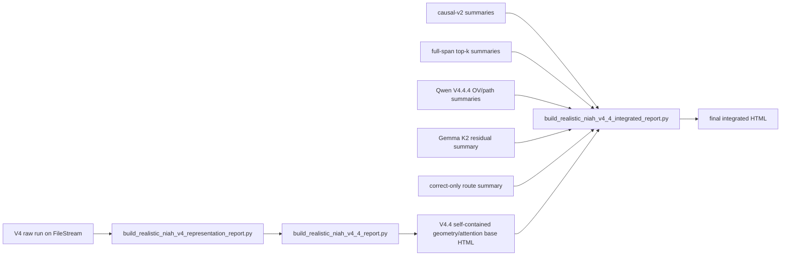

# V4.4 non-thinking integrated mechanism report: reviewer guide

Target report:

`reports/realistic_niah_v4_4_non_thinking_integrated_mechanism_report.html`

This guide answers four review questions:

1. Which code and saved artifacts contribute to each section of the HTML?
2. Which configuration is authoritative for each experiment?
3. How are the interventions, effects and statistical tests defined?
4. What can be rebuilt locally, and what still requires FileStream or missing provenance?

The machine-readable companion is:

`reports/realistic_niah_v4_4_non_thinking_reviewer_manifest.json`

Verify every listed local file, checksum, report section and saved audit with:

```bash
python scripts/audit_realistic_niah_v4_4_report_bundle.py \
  --repo-root . \
  --manifest reports/realistic_niah_v4_4_non_thinking_reviewer_manifest.json
```

## 1. What is reproducible from the shared folder?

There are two distinct reproducibility levels.

### 1.1 Rebuilding the final HTML from local saved summaries: complete

The final report can be rebuilt without a GPU and without the original raw tensors. The required self-contained geometry/attention base HTML and the causal analysis JSON/CSV files are present locally.

```bash
python scripts/build_realistic_niah_v4_4_integrated_report.py \
  --repo-root . \
  --output reports/realistic_niah_v4_4_non_thinking_integrated_mechanism_report.html
```

The generated timestamp changes on each build, so byte-for-byte equality is not expected after rebuilding. Scientific values and embedded plots should be unchanged when the input hashes are unchanged.

### 1.2 Rerunning every GPU experiment from raw stimuli: partial

Most runners, implementations and frozen configurations are present. Raw hidden states, raw attention rows and per-seed causal shards remain under the FileStream run roots listed below. They were intentionally not copied into the HTML repository.

One provenance gap remains: the local folder contains the complete aggregate artifacts for `correct_state_routes`, but no dedicated runner/analysis source file for that campaign was found in the repository. The relevant FileStream host was offline when checked on 2026-08-06. Therefore:

- the saved `effects.csv.gz`, `route_summary.csv`, `geometry_summary.csv` and analysis audit can be inspected;
- the corresponding low-count correct-only campaign cannot yet be claimed as source-complete from this local folder alone;
- this gap does not affect rebuilding the HTML, but it matters for rerunning that one supplement from scratch.

## 2. Two-stage report construction



The final renderer does not recompute PCA, attention or causal statistics. It validates the saved audits, reads the saved values, constructs the tables/figures, and embeds them into one self-contained HTML.

### 2.1 Rendering code

| Role | File | What it does |
|---|---|---|
| Shared representation analysis | `scripts/build_realistic_niah_v4_representation_report.py` | Loads the original V4 run; fits/loads frozen PCA projections; aggregates attention and the original causal tables. |
| V4.4 base renderer | `scripts/build_realistic_niah_v4_4_report.py` | Restricts the shared analysis to `variant == v4.4`; emits prompt/answer geometry and the two attention atlases. |
| Final renderer | `scripts/build_realistic_niah_v4_4_integrated_report.py` | Keeps geometry/attention from the base HTML; reconstructs the V4.4 per-prompt error table to compute absolute deviation; replaces the causal story with the newer full-span, patching and V4.4.4 mechanism results. |

### 2.2 Inputs actually consumed by `build_report_clear`

| Evidence family | Local input |
|---|---|
| Prompt/answer geometry and attention | `reports/v4_non-thinking_causal/v4_4_3/realistic_niah_v4_4_mechanism_report.html` |
| Absolute deviation | The same base HTML's embedded V4.4 answer rows; the builder selects one all-fit layer per model, deduplicates by `seed × gold_count`, validates `prediction − gold = count_error`, and performs 5,000 seed-cluster bootstrap draws. |
| All-sample patching and steering | `reports/v4_non-thinking_causal/v4_4_causal_v2/report_summary.json` |
| Fresh full-span top-k ablation | `reports/v4_non-thinking_causal/v4_4_causal_v2/full_span_topk/seed_extrapolation_summary_v2.json` and `full_span_topk_primary_statistics.csv` |
| Qwen natural OV | `reports/v4_non-thinking_causal/v4_4_4/realistic_niah_v4_4_4_analysis.json` |
| Qwen alpha/value read-write | `reports/v4_non-thinking_causal/v4_4_4/read_write/realistic_niah_v4_4_4_read_write_analysis.json` |
| Qwen full-span early-to-L28 sweep | `reports/v4_non-thinking_causal/v4_4_4/qwen/full_span_upstream/realistic_niah_v4_4_4_upstream_path_analysis.json` |
| Qwen independent early-to-L28 confirmation | `reports/v4_non-thinking_causal/v4_4_4/upstream_confirmation/realistic_niah_v4_4_4_upstream_confirmation_analysis.json` |
| Gemma source-to-residual-to-terminal path | `reports/v4_non-thinking_causal/v4_4_4/gemma/residual/k2/realistic_niah_v4_4_4_residual_analysis.json` |
| Fresh correct-only source patch | `reports/v4_non-thinking_causal/v4_4_4/correct_state_routes/correct_state_route_analysis.json` |

### 2.3 Legacy existence gates in the current builder

The shared `validate_inputs()` function also requires the following files to exist, although `build_report_clear()` does not read their values into the final report:

- `reports/v4_non-thinking_causal/v4_4_causal_v2/exact_sign_flip_reanalysis.json`
- `reports/v4_non-thinking_causal/v4_4_2/realistic_niah_v4_4_2_mode_geometry_attention_report.html`
- `reports/v4_non-thinking_causal/v4_4_4/realistic_niah_v4_4_4_relay_analysis.json`
- `reports/v4_non-thinking_causal/v4_4_4/gemma/natural_ov/realistic_niah_v4_4_4_analysis.json`
- `reports/v4_non-thinking_causal/v4_4_4/correct_state_routes/geometry_summary.csv`

These are technical gate-only dependencies inherited from earlier versions of the renderer. They should not be cited as evidence used by the final claims. `geometry_summary.csv` is nevertheless included in the reviewer bundle because it documents the correct-only supplement.

## 3. Global model, prompt and stimulus setting

Authoritative files:

- `configs/realistic_niah_v4.json`
- `src/realistic_niah_v4/spec.py`
- `src/realistic_niah_v4/prompts.py`
- `src/realistic_niah_v4/stimuli.py`

| Field | Frozen value |
|---|---|
| Models | `Qwen/Qwen3-8B`; `google/gemma-4-E4B-it` |
| Qwen revision | `b968826d9c46dd6066d109eabc6255188de91218` |
| Gemma revision | `ee0ef6023621cff504d758262d4e04895a5af4a2` |
| Canonical tokenizer | `Qwen/Qwen3-8B` at the Qwen revision above |
| Mode | native non-thinking; chat template is called with `enable_thinking=False`; no system prompt |
| Prompt mode | `direct` |
| Answer prefix | `Total:` |
| Scored answers | numeric continuations for counts 1--10, including the registered termination suffix |
| Passage length | target 10,000 tokenizer tokens |
| Counts | 1--10 for the representation run |
| Fixed slot depths | 0.08, 0.17, 0.26, 0.35, 0.44, 0.56, 0.65, 0.74, 0.83, 0.92 |
| Position randomization | minimum 256-token separation where the variant randomizes locations |
| Numeric inference dtype | model `bfloat16`; saved hidden/attention arrays `float16` in the base run |
| Primary report panel | `v4.4` only |

The original source run is:

`/lambda/nfs/CoT-Non-thinking-v4/runs/run_20260731_v4_numeric_presentation_v3`

It contains 30 seeds: discovery 1234--1253 and confirmation 1254--1263. The V4.4 report reuses only the V4.4 panel of this frozen multi-panel run.

## 4. Representation and attention sections

### 4.1 Prompt running-counter geometry

Code path:

- `src/realistic_niah_v4/representation.py`
- `src/realistic_niah_v4/pipeline.py`
- `scripts/build_realistic_niah_v4_representation_report.py`
- `scripts/build_realistic_niah_v4_4_report.py`

For each active needle occurrence, the saved post-block residual at the final token of the needle span is used. PCA display bases and layer choices were frozen on V4.1 discovery data and then applied to V4.4. Thus the V4.4 plots are projections into a previously selected basis, not V4.4-refitted visualizations.

The report's additional running-index plot takes the successive occurrence endpoints from the embedded V4.4 prompt payload. It is a visualization of the same saved states; it is not a separate GPU experiment.

### 4.2 Answer-query geometry

The answer-query state is the residual at the final `Total:` query token. The report embeds both all-fit and correct-only-fit PCA bases while projecting the same V4.4 states. Correct-only changes the fitted basis; it does not silently remove wrong V4.4 points unless the interactive outcome filter is changed.

The joint prompt/answer display first removes each token role's mean and fits a shared PCA on paired V4.1 discovery states. Full-space CKA, centroid-distance correlation and adjacent-step cosine are computed before the 3-D display projection.

### 4.3 Attention atlas and head ranking

Code path:

- `src/realistic_niah_v4/attention.py`
- `src/realistic_niah_v4/attention_outcomes.py`
- `scripts/build_realistic_niah_v4_representation_report.py`

The query is the final answer-query token. Two different key-pooling quantities are displayed:

- endpoint-key mass: attention to the final token of each needle span;
- full-span literal mass: the sum of attention over every token belonging to every active needle literal.

The causal head bank is ranked by the full-span score:

`mean(broad_mass * exp(entropy(per-needle mass)) / needle_count)`.

This combines total literal retrieval with coverage across occurrences. Endpoint mass is retained only as a diagnostic atlas view and is excluded from the frozen causal ranking.

## 5. Causal experiments and exact settings

### 5.1 All-sample answer patching and geometric steering

Authoritative configuration: `configs/realistic_niah_v4_causal_v2.json`.

Entry points and implementation:

- `scripts/freeze_realistic_niah_v4_causal_v2.py`
- `scripts/run_realistic_niah_v4_causal_v2.py`
- `src/realistic_niah_v4/causal_v2.py`
- `src/realistic_niah_v4/causal_generation.py`
- `src/realistic_niah_v4/geometric_steering.py`
- `src/realistic_niah_v4/causal_v2_analysis.py`
- `scripts/audit_realistic_niah_v4_causal_v2.py`

Frozen setting:

- counts 0--10;
- centroid-fit seeds 1234--1253;
- screen seeds 1254--1258;
- held-out confirmation seeds 1259--1263;
- K values 1, 3, 5;
- directed anchor pairs are both directions of:
  - K=1: 0--1, 4--5, 9--10;
  - K=3: 0--3, 3--6, 7--10;
  - K=5: 0--5, 2--7, 5--10.

Answer patching copies the complete donor hidden vector at the final `Total:` query into the receiver. Two protocols are evaluated:

- `single_layer`: replace the state at one frozen layer;
- `cumulative_from_layer`: clamp the donor state from the start layer through the final layer.

Controls are self-patches and same-count other-seed patches. The signed transport effect is the receiver output change in the donor direction, normalized by the semantic donor--receiver count difference. Invalid generations have zero strict success and a separately reported valid rate.

Geometric steering does not copy a donor activation. It adds:

`delta = mean_hidden(target count) - mean_hidden(receiver count)`

at the answer query, with alpha=1. The control is an equal-norm direction orthogonal to `delta`. Screen-selected conditions are evaluated only on the five held-out confirmation seeds.

The saved report contains 149 Qwen and 177 Gemma answer-patching conditions, plus the frozen steering conditions. Seed-cluster bootstrap intervals use 10,000 draws; condition-wise p-values use sign-flip tests and Holm correction within the registered evidence family.

### 5.2 Correct-only answer patching supplement

Authoritative configuration: `configs/realistic_niah_v4_4_correct_interventions.json`.

Code path:

- `scripts/launch_realistic_niah_v4_4_correct_interventions_4x4.sh`
- `scripts/run_realistic_niah_v4_4_correct_interventions_parallel.py`
- `src/realistic_niah_v4/correct_interventions.py`
- `src/realistic_niah_v4/correct_only_slices.py`
- `scripts/audit_realistic_niah_v4_4_correct_interventions.py`

The intervention conditions are not reselected. They are the exact frozen causal-v2 answer-patching conditions. A seed is eligible only when both clean receiver and clean donor answer correctly. Each K-by-direction group requires at least five eligible seed clusters.

Supplement seeds actually needed to close missing groups were:

- Qwen: 1274, 1275, 1276, 1278;
- Gemma: 1275, 1277, 1281, 1295.

Primary strict success is `patched_count == donor_gold_count`; an invalid patched generation is a failure. The report shows both all-sample transport and this correct-only donor-target adoption result.

### 5.3 Fresh full-span ranked top-K ablation

Authoritative files:

- `configs/realistic_niah_v4_4_full_span_topk_confirmation.json`
- `configs/realistic_niah_v4_4_full_span_topk_confirmation_selection.json`

Code path:

- `scripts/launch_realistic_niah_v4_4_full_span_topk_confirmation.sh`
- `scripts/run_realistic_niah_v4_causal_v2.py --stage ablation`
- `scripts/audit_realistic_niah_v4_4_ablation_seed_extrapolation.py`
- `scripts/analyze_realistic_niah_v4_4_full_span_topk.py`

Frozen setting:

- seeds 1316--1335: 20 independent seeds;
- counts 1--5: 100 examples per model;
- K = 1, 2, 4, 8, 16, 32;
- head order frozen by full-span broad-aggregation score before these outcomes;
- intervention boundary: final answer query, pre-`o_proj` head-output slices;
- intervention: set the selected K head slices to zero;
- controls: three head sets with the same per-layer counts, sampled from non-selected heads.

For an example, let `E_ranked` and `E_random,r` be the intervention-induced absolute generated-count changes. The all-sample effect is:

`D_abs = E_ranked - mean_r(E_random,r)`.

On clean-correct examples, the primary effect replaces absolute shift with the indicator that the intervention changes a correct answer to a wrong answer:

`D_cw = I_ranked(correct -> wrong) - mean_r I_random,r(correct -> wrong)`.

The independent unit is seed. Confidence intervals bootstrap the 20 seed effects with 10,000 deterministic draws. Each p-value enumerates all `2^20` sign assignments. Holm correction is applied across 2 models x 6 K values = 12 frozen comparisons, separately for `D_abs` and `D_cw`.

### 5.4 Qwen natural pre-O OV intervention

Authoritative configuration: `configs/realistic_niah_v4_4_4.json`.

Code path:

- `scripts/run_realistic_niah_v4_4_4.py`
- `src/realistic_niah_v4_4_4/spec.py`
- `src/realistic_niah_v4_4_4/pipeline.py`
- `src/realistic_niah_v4_4_4/interventions.py`
- `src/realistic_niah_v4_4_4/analysis.py`
- shared pre-O/set hooks in `src/realistic_niah_v4_4_3/`.

Frozen setting:

- Qwen layer L28, heads H16 and H19;
- direction-fit seeds 1234--1253;
- fit counts 1,3,5,7,9; held-out counts 2,4,6,8,10;
- centering seeds 1264--1273;
- causal confirmation seeds 1274--1293;
- causal counts 2,5,8;
- beta = -2,-1,0,1,2;
- mediation pairs, written as receiver <- donor: 1<-6, 3<-8, 5<-10;
- four outcome-blind matched K=2 control sets.

The natural one-count direction is fitted at the actual pre-attention value-source input `x = RMSNorm(h)`. For query head `h` with GQA group `g(h)`:

`d_z,h = W_V,g(h) * slope_x`.

Natural OV steering modifies the real pre-`W_O` head state:

`z_h <- z_h + beta * d_z,h`.

The residual change is produced only through the model's own `W_O`. Centered removal estimates the count-zero intercept `z0` from independent center seeds and removes the candidate-set component along the natural output direction. Mediation first patches donor `z`, then blocks that natural direction. The primary decision is an intersection-union test requiring natural signal, injection, removal and mediation to pass the registered alpha.

### 5.5 Qwen alpha/value factorization

Authoritative configuration: `configs/realistic_niah_v4_4_4_readwrite.json`.

Code path:

- `scripts/run_realistic_niah_v4_4_4_readwrite.py`
- `src/realistic_niah_v4_4_4/readwrite.py`
- `src/realistic_niah_v4_4_4/readwrite_pipeline.py`
- `src/realistic_niah_v4_4_4/readwrite_analysis.py`

Frozen setting:

- mediator L28, H16/H19;
- discovery seeds 1264--1273;
- evaluation seeds 1274--1293;
- bidirectional pairs 1<->6, 3<->8, 5<->10;
- downstream trace layers L28--L35;
- write counts 2,5,8; beta=1;
- tail width 64 tokens.

For every receiver/donor pair, four head states are constructed:

- RR: receiver attention weights and receiver values;
- RD: receiver attention weights and donor values;
- DR: donor attention weights and receiver values;
- DD: donor attention weights and donor values.

Comparing RR to RD isolates the value/content contribution; comparing RR to DR isolates the routing/attention contribution. The Shapley-style closure check verifies that the four-way decomposition reconstructs the observed donor--receiver difference to the registered tolerance.

### 5.6 Qwen full-span early-head to L28 path

Authoritative configurations:

- `configs/realistic_niah_v4_4_4_qwen_full_span_upstream_k_sweep.json`
- `configs/realistic_niah_v4_4_4_upstream_confirmation.json`

Code path:

- `scripts/run_realistic_niah_v4_4_4_upstream_path.py`
- `scripts/run_realistic_niah_v4_4_4_upstream_confirmation.py`
- `src/realistic_niah_v4_4_4/upstream_path.py`
- `src/realistic_niah_v4_4_4/upstream_path_pipeline.py`
- `src/realistic_niah_v4_4_4/upstream_path_analysis.py`
- `src/realistic_niah_v4_4_4/upstream_confirmation_analysis.py`

Full-span K sweep:

- seeds 1284--1293;
- counts 1--10;
- both directions of 1<->6, 3<->8, 5<->10;
- early K = 1,2,4,8,16,32 from candidates below L28;
- tested routes: `slot_edge_qk`, `answer_query_full`, `slot_state`;
- downstream set: L28 H16/H19;
- primary behavioral metric: donor log-odds gain.

The frozen early top-4 is L27H18, L23H29, L23H13, L23H28. The independent confirmation uses seeds 1294--1313 and an independently frozen top-4 family L27H18, L23H28, L23H29, L26H20. It additionally compares the full L28 H16--H19 set with four leave-one-out sets.

### 5.7 Gemma full-span source to residual to terminal path

Authoritative configuration: `configs/realistic_niah_v4_4_4_gemma_full_span_residual_k2.json`.

Code path:

- `scripts/run_realistic_niah_v4_4_4_gemma_full_span_residual.py`
- `src/realistic_niah_v4_4_4/gemma_full_span_residual_spec.py`
- `src/realistic_niah_v4_4_4/gemma_cross_layer.py`
- `src/realistic_niah_v4_4_4/gemma_residual.py`
- `src/realistic_niah_v4_4_4/gemma_residual_pipeline.py`
- `src/realistic_niah_v4_4_4/gemma_residual_analysis.py`

Frozen setting:

- source set L29H4 and L35H2, ranked by the same full-span score;
- three matched K2 controls: {L29H5,L35H3}, {L29H6,L35H4}, {L29H7,L35H5};
- discovery seeds 1630--1639;
- confirmation seeds 1640--1659;
- counts 1--10; odd counts fit, even counts held out;
- receiver <- donor pairs 1<-6, 3<-8, 5<-10;
- candidate residual mediator layers L36--L40, selected on discovery only;
- selected mediator L37;
- terminal trace layer L41;
- primary alpha 0.025; 10,000 bootstrap draws.

Gemma's sliding-attention architecture means L29 and L35 are full-attention layers that can read the distant prompt, while L36--L40 preserve/transform the answer-query residual locally. The experiment patches the frozen source-set output, tests transport into candidate residual layers, freezes L37 from discovery, and then measures propagation/adoption at L41.

### 5.8 Fresh low-count correct-only source patch

Saved artifacts:

- `reports/v4_non-thinking_causal/v4_4_4/correct_state_routes/effects.csv.gz`
- `route_summary.csv`
- `geometry_summary.csv`
- `correct_state_route_analysis.json`

Frozen setting recorded in the artifacts/report ledger:

- 20 seeds: 1700,1701,1702,1704,1706--1713,1715--1722;
- counts 1,2,3;
- all six directed donor/receiver pairs;
- both donor and receiver must be clean-correct;
- Qwen source heads L27H18,L23H28,L23H29,L26H20; writer heads L28 H16--H19;
- Gemma source heads L29H4,L35H2,L35H7,L35H1,L35H3,L29H2; writer heads L36 H2,H4,H6,H7;
- Qwen answer-query aggregate relation `cross`; Gemma relation `native`;
- seed is the unit of inference; sign-flip and bootstrap results are saved in the JSON/CSV.

The final report uses only the positive source-patch behavioral result from this branch. It does not use the unsupported writer-mediation family as evidence. As noted above, the aggregate artifacts pass their internal audit, but the dedicated campaign source code is currently missing locally.

## 6. Report section to code/data map

| Final section | Rendering function/family | Main evidence input |
|---|---|---|
| Mechanism overview | `build_mechanism_overview_detailed` | causal-v2, Qwen OV/read-write/upstream, Gemma residual, correct-only route summary |
| Scope/conclusions | `build_scope_clear` | causal-v2, Qwen natural OV, Qwen full-span upstream, Gemma residual |
| Setting and causal ledger | `build_methods_clear`, `build_causal_experiment_ledger` | frozen configs and analysis metadata |
| Prompt geometry | inherited base HTML plus `build_running_index_block` | embedded prompt projection payload from the V4 source run |
| Answer geometry | inherited base HTML plus fit-sensitivity block | embedded answer and joint projection payloads |
| Attention | inherited V4.4 atlas; default switched to full-span | embedded attention atlas/phenotype rows |
| Ablation/patching | `build_causal_section_clear` | causal-v2 summary, full-span top-K summary/statistics, correct-only summary |
| Write/propagation | `build_positive_mechanism_section` | Qwen OV/read-write/upstream and Gemma residual JSONs |
| Synthesis | `build_synthesis_clear` | Qwen upstream and Gemma residual results |
| Reproduction ledger | `build_limits_clear` | paths, schemas and audit statuses |

## 7. Statistical conventions

- Independent replication unit: seed, unless a table explicitly labels a pooled eligible-example sensitivity analysis.
- Confidence intervals: nonparametric seed-cluster bootstrap, normally 10,000 deterministic draws; the independent Qwen upstream confirmation uses 20,000.
- Sign-flip tests: exact enumeration when there are at most 20 seed effects. The full-span K sweep enumerates all 1,048,576 assignments for 20 seeds.
- Multiplicity:
  - full-span top-K: Holm across 12 model-by-K comparisons per endpoint;
  - causal-v2: Holm within the registered held-out evidence family;
  - natural OV: the primary decision is an intersection-union test, with secondary K analyses corrected separately;
  - Gemma K2 residual: registered alpha 0.025.
- Invalid generation policy: strict target-hit/correctness treats invalid output as failure; signed numeric shifts use the registered valid denominator and report valid rate separately.

## 8. Code-review order

For an efficient external audit, review in this order:

1. Run the bundle verifier and confirm all hashes/audits.
2. Read `configs/realistic_niah_v4.json` and `src/realistic_niah_v4/prompts.py` to establish the shared prompt/model contract.
3. Review `configs/realistic_niah_v4_4_full_span_topk_confirmation_selection.json` before looking at outcomes; it documents that full-span ranking and K were frozen.
4. Review `src/realistic_niah_v4/causal_v2.py` and `causal_generation.py` for patch/ablation boundaries.
5. Review `src/realistic_niah_v4_4_4/interventions.py` and the inherited set hooks for true pre-`W_O` operations.
6. Review `readwrite.py` for the RR/RD/DR/DD construction.
7. Review `upstream_path.py` and `gemma_residual.py` for cross-layer blocking/transport.
8. Compare the source analysis JSONs with the values emitted by `build_realistic_niah_v4_4_integrated_report.py`.
9. Treat `correct_state_routes` as aggregate-auditable but not source-complete until its dedicated runner is recovered.

## 9. FileStream provenance

Known roots/namespaces:

| Family | FileStream root or namespace |
|---|---|
| Base V4 representation | `/lambda/nfs/CoT-Non-thinking-v4/runs/run_20260731_v4_numeric_presentation_v3` |
| Qwen causal-v2 | `/lambda/nfs/CoT-Non-thinking-v4/runs/run_20260803_v4_4_causal_v2_k135_monotonic_qwen` |
| Gemma causal-v2 | `/lambda/nfs/CoT-Non-thinking-v4/runs/run_20260803_v4_4_causal_v2_k135_monotonic_gemma` |
| Correct-only causal-v2 supplement | `/lambda/nfs/CoT-Non-thinking-v4/runs/run_20260804_v4_4_correct_interventions_4x4_a10080_utf8safe_cda0d09` |
| Full-span K sweep | `/lambda/nfs/CoT-Non-thinking-v4/runs/run_20260805_v4_4_full_span_topk_k1_2_4_8_16_32` |
| Qwen natural OV/read-write | `/lambda/nfs/CoT-Non-thinking-v4/runs/v4_4_4_natural_ov/run_20260803_v4_4_4_natural_ov_qwen_l28_a100_1501368870_v1` |
| Qwen independent upstream | `/lambda/nfs/CoT-Non-thinking-v4/runs/v4_4_4_natural_ov/run_20260804_v4_4_4_upstream_confirmation_qwen_l28_a100_1501366726_v1` |
| Qwen full-span upstream namespace | `/lambda/nfs/CoT-Non-thinking-v4/runs/v4_4_4_full_span_topk/qwen_upstream_k_sweep/` |
| Gemma residual K-sweep namespace | `/lambda/nfs/CoT-Non-thinking-v4/runs/v4_4_4_full_span_topk/gemma_residual_k_sweep/` |
| Correct-state routes | `/lambda/nfs/CoT-Non-thinking-v4/runs/v4_4_4_correct_state_routes/run_20260805_dual_model_lowcount_correct` |

For causal-v2, `reports/v4_non-thinking_causal/v4_4_causal_v2/source_ledger.csv` records the individual remote artifact paths, sizes and SHA-256 values. For Qwen V4.4.4, `reports/v4_non-thinking_causal/v4_4_4/filestream_manifest.json` records the run/source roots and output namespace.

## 10. Environment

GPU/mechanistic runs use `requirements-mechanistic-v4.txt`:

- PyTorch 2.7.0;
- torchvision 0.22.0;
- Transformers 5.14.1;
- NumPy >=1.26,<2;
- CUDA 12.8 wheels for the validated formal environment.

CPU report/statistical analysis uses `requirements-analysis.txt`:

- NumPy >=1.26,<2;
- pandas >=2.2,<3;
- SciPy >=1.13,<2;
- scikit-learn >=1.4,<2;
- matplotlib >=3.8,<4;
- pytest >=8,<9.

The final integrated HTML renderer itself uses only the Python standard library, because its numerical inputs and SVG/JavaScript payloads have already been saved.
